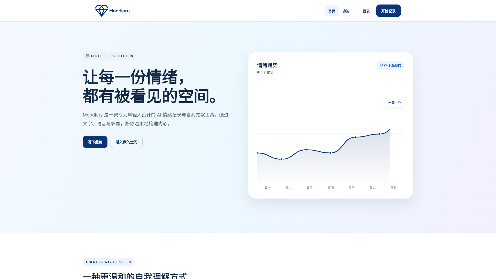
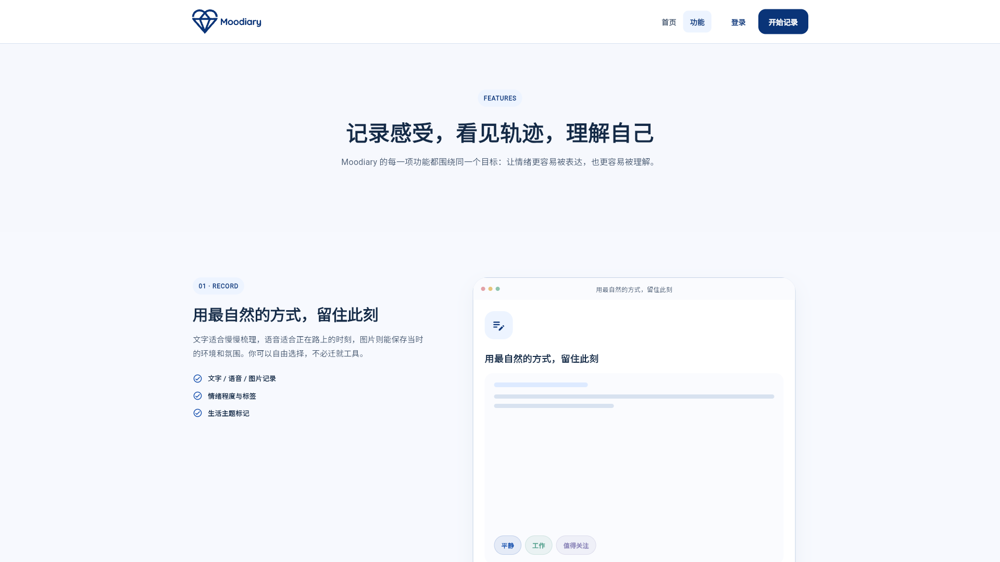
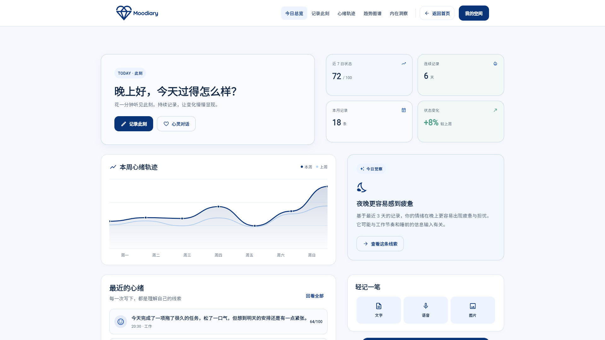
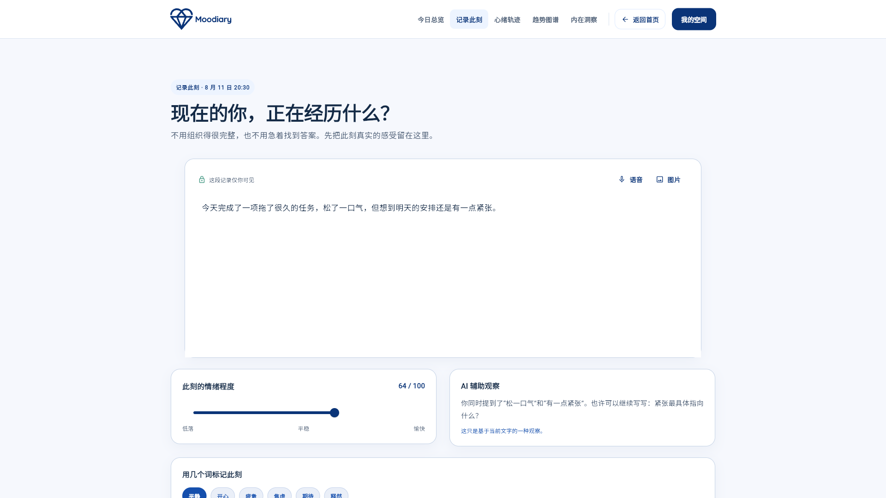
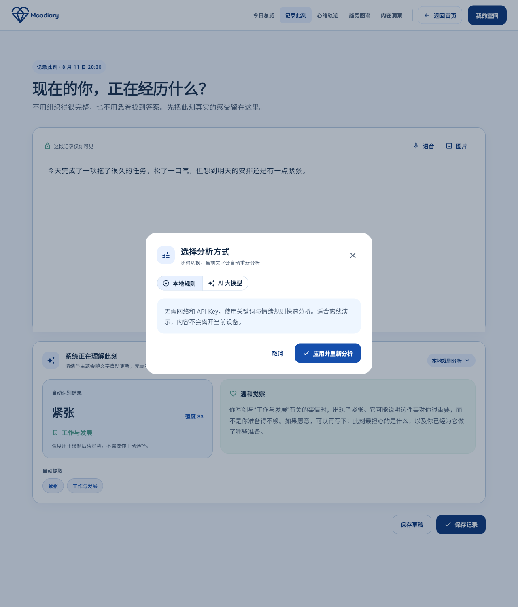
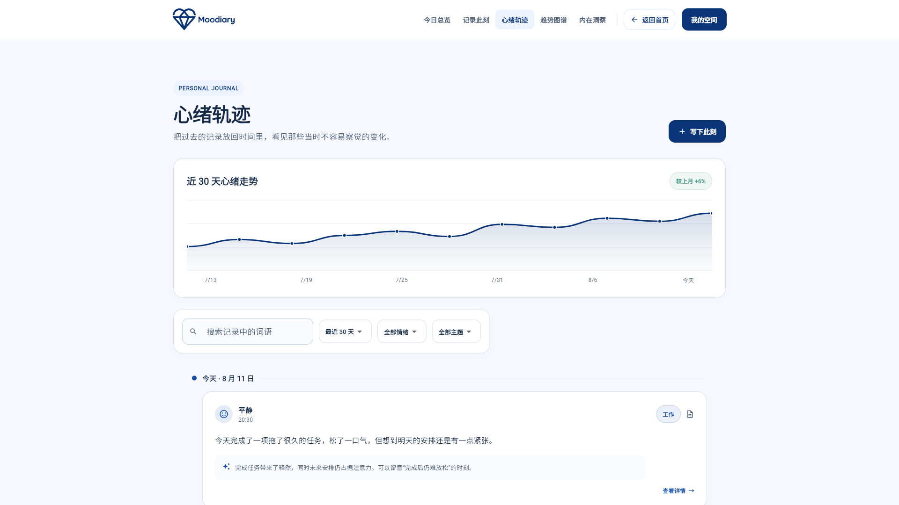
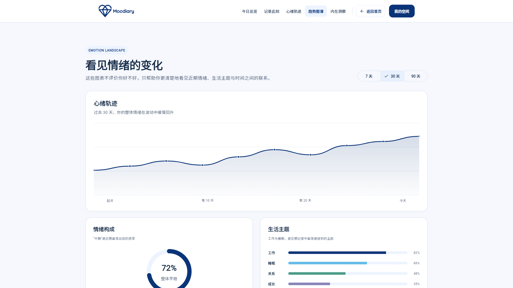
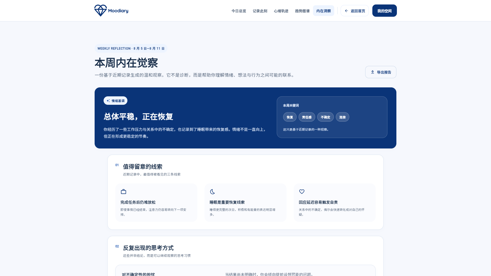
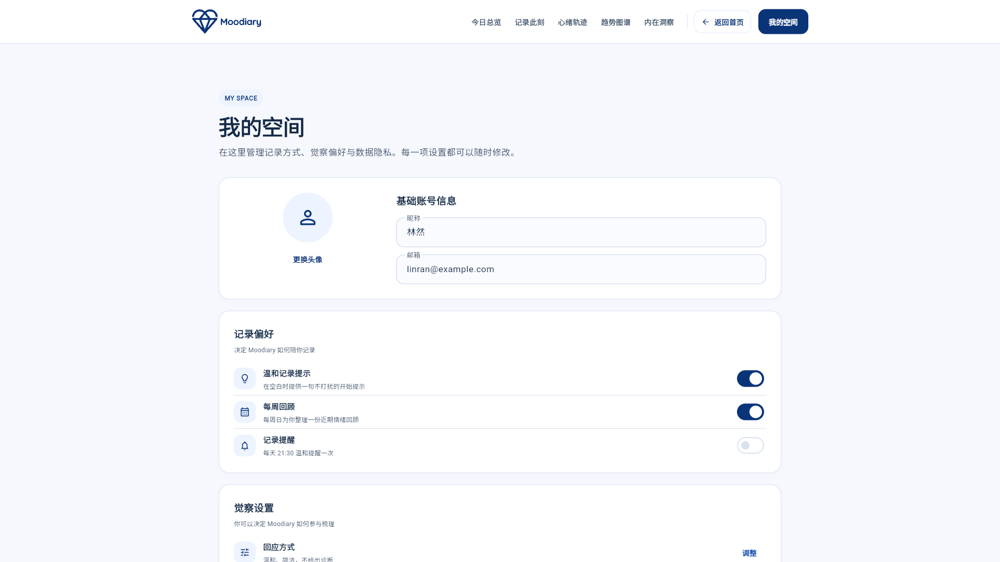
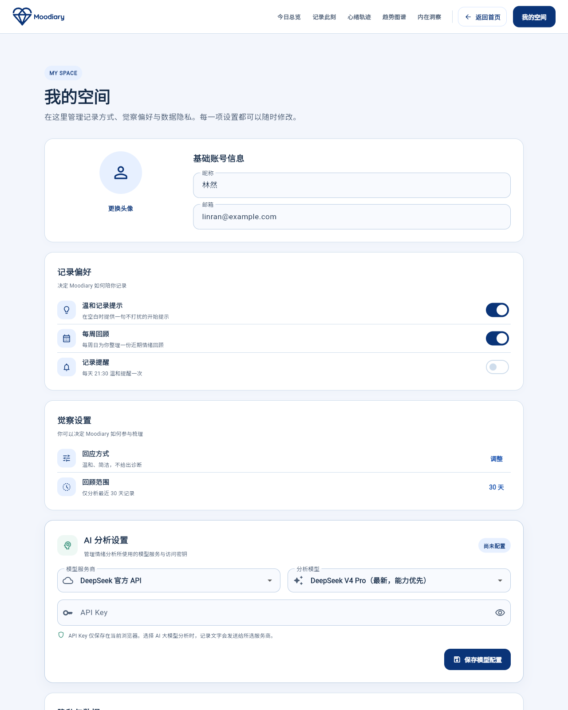

# Moodiary

Moodiary 是一款情绪日记产品。
它帮助你写下当下感受。
也帮助你看见长期变化。

在线体验：<https://easonchen411256-wq.github.io/Moodiary-myself/>

> 本仓库用于 GitHub Pages。
> 文件来自 Flutter Web 发布构建。
> Flutter 源码保存在开发工程中。
> 本仓库不直接维护 Dart 源码。

## 一、产品理念

### 核心价值

Moodiary 让情绪更易表达。
也让情绪更易被理解。

你可以写下一句话。
也可以留下一个片段。
不必先想清楚原因。

产品会保留你的记录。
它也会整理变化线索。
你可以随时回到原文。

### 设计理念

- **先表达，再理解**：不要求立即分析自己。
- **轻量而持续**：几句话也算一次记录。
- **温和而不评判**：只提供观察线索。
- **从线索回到原文**：每条洞察都有记录可查。
- **智能功能可选择**：可用本地规则分析。
- **数据控制在你手中**：按需使用 AI 功能。

### 想解决的问题

情绪来得快，表达却常常很慢。
很多人只知道“今天不太好”。
却说不清具体发生了什么。

单次记录也很难看出规律。
睡眠、工作和人际关系。
都可能影响当下状态。

Moodiary 用三种方式提供帮助：

1. 及时留下情绪线索。
2. 按时间整理历史记录。
3. 用图表和洞察支持复盘。

它不替你下诊断。
也不替你做重要决定。

### 目标用户

- 想培养记录习惯的人。
- 不喜欢复杂表格的人。
- 想观察生活节奏的人。
- 关注隐私的 AI 用户。
- 学生、研究者和创作者。
- 需要低打扰反思工具的人。

Moodiary 不是医疗工具。
它不能替代心理治疗。
也不能替代危机干预服务。

## 二、新界面功能文档

### 1. 首页

首页介绍产品定位。
也展示记录和洞察的关系。

点击“写下此刻”。
即可进入记录页面。
点击“进入我的空间”。
即可查看应用总览。

*图 1：首页展示产品定位与入口。*

适合第一次打开产品时使用。
也适合快速了解产品理念。

### 2. 功能介绍

功能页集中展示产品能力。
页面分为三组内容：

- 留住此刻。
- 看见轨迹。
- 温柔回应。

从首页顶部导航进入功能页。
阅读卡片即可了解各项能力。

*图 2：功能页说明记录、轨迹和回应。*

适合新用户熟悉产品边界。

### 3. 页面导航

页面使用统一的顶部导航。
桌面端可直接切换页面。
窄屏端可打开导航菜单。

品牌标识可以回到首页。
主要按钮会引导下一步操作。

适合跨设备浏览。
也适合快速切换模块。

### 4. 今日总览

今日总览展示近期状态。
页面包含以下信息：

- 近七日状态。
- 连续记录天数。
- 本月记录数量。
- 状态变化趋势。
- 最近的心绪记录。

点击“记录此刻”。
可以开始新的记录。
点击“心灵对话”。
可以用问答方式开始表达。

*图 3：今日总览汇总近期状态。*

适合每天打开产品时使用。
也适合决定下一步行动。

### 5. 记录此刻

记录页用于保存当下感受。
你可以输入文字。
也可以补充情绪和标签。

页面支持语音入口。
也支持添加图片。

点击“保存草稿”。
可以暂存未完成内容。
点击“保存记录”。
即可完成提交。

*图 4：记录页支持文字、语音和图片。*

适合即时记录。
也适合睡前整理一天。

### 6. 分析方式

记录页可以选择分析方式。
目前提供两种选择：

- **本地规则**：无需网络。
- **AI 大模型**：适合深入理解文字。

本地规则适合离线使用。
也适合隐私要求较高的场景。

AI 分析使用已保存的模型配置。
切换方式后，点击“应用并重新分析”。

*图 5：记录时可切换分析方式。*

适合比较不同分析结果。
也适合按需控制数据流向。

### 7. 心灵对话

心灵对话用问题帮助你表达。
你不必一次写完日记。
跟着提示逐步回答即可。

对话结束后可整理成记录。

适合不知道如何下笔时使用。
也适合梳理一件具体的事。

### 8. 心绪轨迹

心绪轨迹按时间展示记录。
你可以滚动查看历史内容。
也可以按条件筛选记录。

点击记录可查看详情。
也能从原文继续书写。

*图 6：时间线帮助你回看历史记录。*

适合复盘一段时间。
也适合寻找情绪转折点。

### 9. 趋势图谱

趋势图谱用图表展示变化。
页面关注以下信息：

- 近期情绪趋势。
- 近三十日概览。
- 不同时段的状态。
- 整体状态变化。

*图 7：趋势图谱呈现情绪变化。*

适合周回顾和月度复盘。
也适合观察生活节律。

### 10. 内在洞察

内在洞察整理近期线索。
内容包括以下部分：

- 本周内在觉察。
- 值得留意的线索。
- 反复出现的思考方式。
- 下一周的小小练习。

每条线索都能回到原始记录。
你也可以导出洞察报告。

*图 8：洞察页把记录整理成可观察线索。*

适合完成一周回顾。
也适合把觉察变成小行动。

### 11. 我的空间

我的空间管理个人偏好。
页面提供以下设置：

- 温和记录提示。
- 每周回顾提醒。
- 每日记录提醒。
- 回顾数据范围。
- 回应方式。
- 隐私和本地保存。
- 数据导出。

数据可以导出为 JSON。
也可以导出为 PDF。

*图 9：我的空间管理偏好与数据。*

适合首次使用时设置。
也适合定期备份数据。

### 12. AI 分析设置

AI 设置用于管理模型配置。
你可以选择分析模型。
也可以调整回应方式。

使用前请检查数据提示。
再决定是否启用 AI 分析。

*图 10：AI 设置用于管理智能分析。*

适合需要更丰富反馈时使用。
对隐私敏感时可关闭该功能。

### 13. 登录与账号

登录页提供账号入口。
页面支持登录和注册。
也支持找回密码。

本地记录不一定需要登录。
具体能力以当前版本设置为准。

## 使用建议

1. 先写下一条短记录。
2. 连续记录几天再看趋势。
3. 把洞察当作观察线索。
4. 需要时回到原始记录。
5. 定期导出个人数据。

## 发布信息

- 发布地址：<https://easonchen411256-wq.github.io/Moodiary-myself/>
- 发布分支：`main`
- 发布方式：Flutter Web 与 GitHub Pages
- 当前路径：`/Moodiary-myself/`
